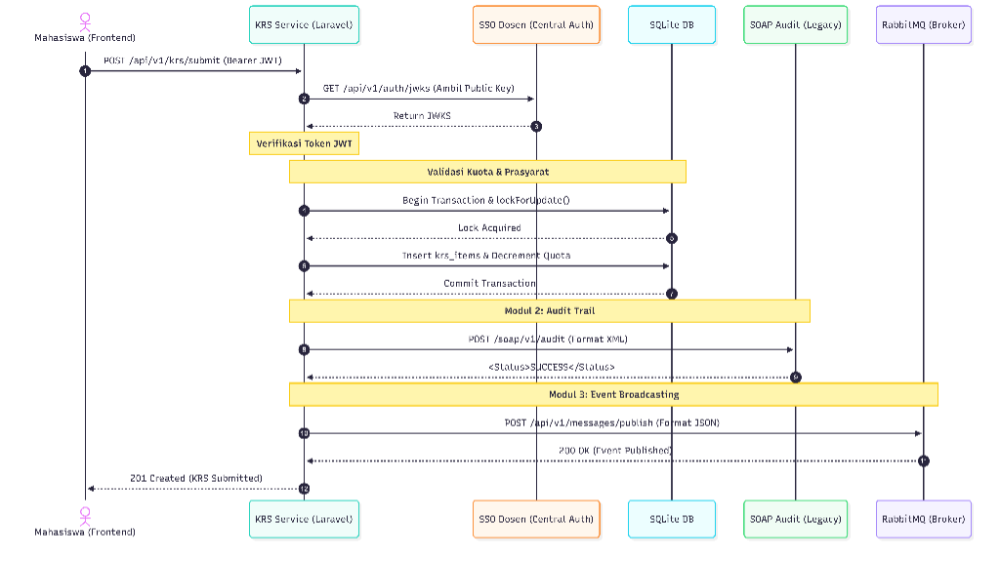

# Analisis Tugas 3: Integrasi Aplikasi Enterprise

## Identitas Mahasiswa
*   **Nama**: Galih Hirpana
*   **NIM**: 102022400068
*   **Kelas**: SI4808
*   **Program Studi**: S1 Sistem Informasi, Telkom University
*   **Layanan**: Service Mata Kuliah & KRS

---

## 1. Justifikasi Transaksi Kritis
Endpoint `POST /api/v1/krs/submit` pada Service Mata Kuliah & KRS ditetapkan sebagai transaksi paling kritis dalam ekosistem ini. Terdapat beberapa alasan teknis dan fungsional yang mendasari hal tersebut:  

*   **State-Changing Transaction**: Proses ini secara langsung memodifikasi *state* database yang krusial, yaitu mengurangi `remaining_quota` pada tabel `courses` dan menyisipkan kontrak pembelajaran baru ke dalam tabel `krs_items`.  
*   **Pencegahan Race Condition**: Karena kuota kelas diperebutkan oleh banyak mahasiswa secara bersamaan, transaksi ini menerapkan mekanisme *Pessimistic Locking* (`lockForUpdate()`) di dalam sebuah Database Transaction untuk memastikan konsistensi data absolut.
*   **Pemicu Alur Bisnis Lintas Departemen**: Kesuksesan transaksi ini menjadi *trigger* (pemicu) utama bagi berjalannya proses bisnis di departemen lain. Tanpa transaksi ini, Service Nilai & Kurikulum tidak akan tahu kapan harus membuat baris nilai akademik yang baru untuk mahasiswa.  

---

## 2. Sequence Diagram Interaksi Layanan
Diagram di bawah ini memvisualisasikan aliran data terpusat ketika mahasiswa melakukan pengajuan KRS, yang melibatkan validasi keamanan (SSO), penguncian database lokal, pencatatan audit legacy, dan penyebaran event secara asinkron.

### Alur Interaksi:
1. Klien mengirimkan request pengajuan KRS beserta Token JWT.
2. KRS Service meminta Public Key (JWKS) dari SSO Dosen untuk memvalidasi token secara lokal.  
3. Validasi aturan bisnis lokal berjalan (pengecekan kuota dan *Pessimistic Locking* pada SQLite).  
4. KRS Service mengirimkan format XML kaku ke sistem SOAP Audit.  
5. KRS Service menyebarkan event notifikasi ke RabbitMQ Central Exchange untuk ditangkap oleh layanan lain.  
6. Respons sukses dikembalikan ke klien.  

---

## 3. Capaian Teknis Implementasi (PLO08-CLO03)
Implementasi kode pada Service Mata Kuliah & KRS telah berhasil memenuhi seluruh komponen teknis yang diwajibkan:  

### Modul 1: Federated SSO (30%)
*   **Status**: Selesai   
*   **Implementasi**: Sistem telah dilengkapi dengan middleware khusus yang mampu mencegat Token JWT dari header `Authorization`. Token tersebut kemudian di-decode dan diverifikasi menggunakan Public Key (JWKS) berstandar RS256 yang diambil secara dinamis dari Cloud Dosen (`https://iae-sso.virtualfri.id/api/v1/auth/jwks`). Jika token palsu atau kedaluwarsa, akses akan ditolak dengan status 401.  

### Modul 2: SOAP XML Client (40%)
*   **Status**: Selesai   
*   **Implementasi**: Proses pencatatan audit telah diintegrasikan di dalam `KrsController` tepat setelah Database Transaction berhasil di-commit. Data JSON (NIM, ID Course, status) ditransformasi secara hardcoded ke dalam format XML Envelope yang memuat tag spesifik `<TeamID>`, `<ActivityName>`, dan `<LogContent>` dalam blok CDATA, lalu dikirim via HTTP POST ke `iae-sso.virtualfri.id/soap/v1/audit` dan divalidasi dengan kembalian `<Status>SUCCESS</Status>`.  

### Modul 3: AMQP Publisher (20%)
*   **Status**: Selesai   
*   **Implementasi**: Untuk menjembatani komunikasi ke Service Nilai & Kurikulum, sistem mempublikasikan pesan JSON ke endpoint HTTP RabbitMQ `iae.central.exchange` dengan routing key `krs.submitted.event`. Publikasi ini berjalan mulus tanpa mengganggu alur utama response kepada pengguna.  

### Modul 4: Akuntabilitas & Progres (10%)
*   **Status**: Selesai   
*   **Implementasi**: Seluruh jejak riset, debugging struktur XML SOAP, dan implementasi arsitektur dari awal hingga akhir telah didokumentasikan dan dilampirkan pada file log prompt engineering AI di repository ini.  
